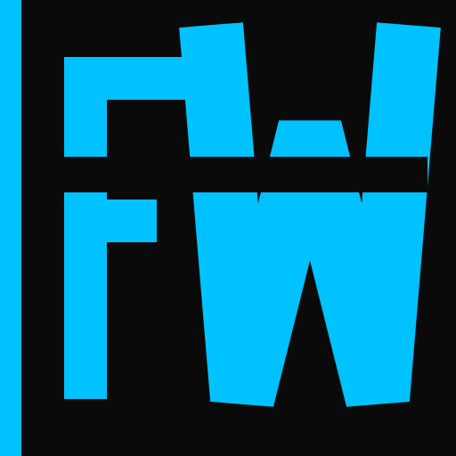
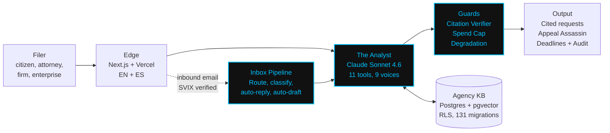
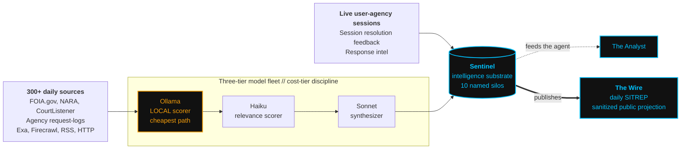

# Joel Sartain

**Founder, FOIA Warfare**

The agency side has been designed for two years. The requester side has not been designed at all. FOIA Warfare is the requester-side architecture.

---

## FOIA Warfare

AI-native FOIA and Privacy Act platform. Built by a federal records practitioner, not a Silicon Valley startup. Every request cites the right statute, targets the right office, and arrives with the fee waiver built in. From question to filed request in under 60 seconds.

Capable requesters are no longer the exception. They draft with large language models, map custodians from inspector general reports, and reverse-engineer exemption patterns from agency reading rooms. The architecture has to match the operator. FOIA Warfare is the requester's instrument of record.

---

## The asymmetry

> Agency-side AI tools deployed across the federal FOIA workflow: nine plus.
> Requester-side AI tools deployed at any federal agency: zero.

The agency side has been designed in public. Five federal pilots are in field testing. A fully specified five-stage architecture is sitting inside the official body that recommends FOIA reform to the Archivist of the United States. The requester side has no comparable architectural voice. The journalist-segment incumbent walked away from request automation under agency backlash. The next requester-side actor was always coming.

We are it. FOIA Warfare is the requester-side architecture, built for the demand environment that arrives, not the one that already passed. Automated request generation, automated appeals on adverse determinations, automated response audit, automated agency intelligence ingestion, automated editorial output. The hardest problems in records work are the ones we treat as core, not as roadmap.

---

## Who it serves

The same platform scales from a single citizen filing one personal records request to an enterprise legal team running a sustained campaign of records work. Same statutory rigor at every tier.

- Individual filers running personal records cases
- Solo practitioners (immigration, criminal defense, plaintiff-side civil)
- Multi-attorney firms running parallel FOIA campaigns
- Enterprise legal, compliance, and risk teams
- Press, advocacy, and watchdog organizations

### [→ foiawarfare.com](https://foiawarfare.com)

---

## Scale

<table align="center">
  <tr>
    <td align="center"><strong>754</strong> commits on main</td>
    <td align="center"><strong>142,957</strong> lines TypeScript</td>
    <td align="center"><strong>131</strong> Supabase migrations</td>
    <td align="center"><strong>209</strong> vitest test files</td>
  </tr>
  <tr>
    <td align="center"><strong>117</strong> API routes</td>
    <td align="center"><strong>2,457</strong> i18n keys (EN+ES)</td>
    <td align="center"><strong>11</strong> AI tools (Zod-typed)</td>
    <td align="center"><strong>9</strong> voice registers</td>
  </tr>
  <tr>
    <td align="center"><strong>10</strong> Sentinel silos</td>
    <td align="center"><strong>6</strong> ingestion sources</td>
    <td align="center"><strong>3</strong> model tiers (local + Haiku + Sonnet)</td>
    <td align="center"><strong>1,000+</strong> line core system prompt</td>
  </tr>
</table>

Stats as of May 2026. Source repository is private. Numbers are real.

---

## Architecture // Request lifecycle

---

## Architecture // Autonomous intelligence layer

Sentinel is the self-learning intelligence pipeline that feeds the agent. Hunter is the autonomous daily ingestion engine that feeds Sentinel. The Wire is the editorial publication that projects Sentinel's intelligence out to the public.

The local Ollama scorer in Hunter is the cheapest possible path. Items survive local screening before any Anthropic spend is committed. Cost-tier discipline at every stage. Hunter currently monitors over 300 daily sources, with the agency knowledge base widening every time a user resolves a session against a real FOIA office.

---

## What it does

The right agency. The right statute. The right office. The right deadline. The right appeal when it lands wrong.

- **The Analyst.** Conversational intake driven by a 1,000-line core system prompt with nine voice registers (Coach for new users, Expert Clerk for prepared filers, Advocate when the agent meets frustration). The Analyst does the agency identification the requester usually gets wrong.
- **Automated drafting.** Properly cited request body with 5 USC 552 / 552a anchors, fee waiver justification, expedited processing language when warranted, agency-specific formatting. Bilingual where filers need it.
- **Appeal Assassin.** When an agency response lands wrong - adverse determination, unjustified withholding, exemption misapplied - Appeal Assassin auto-drafts the appeal with statutory grounds, deadline math, and submission routing. Same tier of rigor as the original request.
- **Email inbox pipeline.** Every inbound agency message routes through SVIX signature verification, address-based case attribution, user-forward detection, and intent classification before reaching the agent. Auto-reply and auto-draft engage where the user has opted in.
- **Response audit.** When the agency response comes back, the platform compares it against the original ask and flags what was withheld, what was missed, and what the appeal grounds are. Released documents are mapped back to their originating request.
- **Sentinel + Hunter + The Wire.** An autonomous self-learning intelligence stack running in the background. Hunter ingests FOIA.gov, NARA, CourtListener, agency request-logs, Exa, and RSS daily. Items are screened by a local Ollama model, scored by Claude Haiku, and synthesized by Claude Sonnet. Sentinel writes structured intelligence into ten named silos. The Wire publishes a sanitized daily SITREP from that intelligence. The platform learns where the user pushes and the field moves.
- **Deadlines.** 20 business days, statutory. Amber at day 15. Red at day 20. Appeal at day 21. No silent expiration.

---

## Production rigor

We approached this from the ground up with **data security, statutory integrity, and aggressive token efficiency**. None of these are bolt-ons.

**Security and integrity**

- Supabase Row-Level Security policies authored in the same migration as the table they protect, never after the fact
- 131 forward migrations shipped with paired rollback files in the same commit. Operational rollback path is a precondition for shipping, not an afterthought
- Anti-poisoning defenses in the ingestion layer. Untrusted user-reported intel is sanitized and source-tracked before it enters the agent's grounding
- SVIX-verified webhooks on every external inbound surface (Resend inbound, Stripe). No raw payload trusted
- Sentinel provenance + source-register pipelines retain attribution on every fact the agent can cite
- Citation verification guard runs post-LLM on every generated request before it reaches the user. The Wire runs its own citation verifier on every editorial output

**Token efficiency // three-tier model fleet**

- **Local first.** Hunter's Ollama scorer screens every fetched item on a local model before any cloud spend is committed. Items that do not pass local screening never touch Anthropic
- **Haiku for cheap-path tasks.** Sentinel's classifier, Hunter's relevance scorer, and the email inbox intent router all run on Claude Haiku 4.5 under a daily cost cap
- **Sonnet for generation.** Claude Sonnet 4.6 handles request drafting, appeal drafting, and Sentinel synthesis. Reserved for work that demands strong-model quality
- **Anthropic prompt caching** on the 1,000-line core system prompt. Determinism preserved, per-call cost reduced
- **Per-user spend cap pre-flight.** Every model call reserves spend before generation. Over-cap users get a specific block reason, not a silent failure
- **Free-tier session circuit breaker.** Hard ceiling on anonymous generation before account creation required
- **Four named degradation levels.** Distinct user-facing copy for each (model overloaded, model unavailable, tool error, hard fail). No "Oops! Something went wrong."

**Operational integrity**

- 209 vitest test files plus Playwright end-to-end at three viewports (375, 768, 1280) gated in CI
- Bilingual CI parity gate. Build fails if EN and ES key sets diverge
- Design doctrine enforced. Dark theme, cyan accent, Geist Sans and Mono, structural-zero radius, skeleton screens, no spinners, no em dashes anywhere portfolio-wide
- PostHog and Sentry instrumentation on conversion-critical paths. Error attribution by user and tenant

---

## Stack

---

## How we build // FLEET

We ship via **FLEET**, a persistent autonomous engineering operations system. T1 quarterback (Opus) sets strategy. T2, T4, T6 middle managers (Opus) author Codex prompts for the backend, API, and UI lanes. Codex executors run each ticket in an isolated worktree. T1 ratifies in the morning. The founder runs the strategic line. The fleet does the keyboard.

Every PR moves through:

- **Magnifying-glass review.** T1 reads every modified file end-to-end before any visual asset reaches the founder. No surrogate trust.
- **Red-team passes.** Adversarial review on dispatches before fire. Self-red-team before EOM.
- **Do-better protocol.** Every dispatch gets a structured DO BETTER pass through nine review lenses before it leaves the terminal.
- **Comms protocol.** Triple-dash fenced messages, DTG on every terminal-to-terminal communication, structured DECISION REQUEST format on every stop condition. Hard gates have no escape hatch.

This is not a build philosophy. It is how the code ships, today, on this product. The methodology is language-agnostic. TypeScript is what we picked. The discipline transfers to any stack.

**Build stack**

---

## Domain depth

Built from operational FOIA experience. The founder filed personal records requests at the federal level and saw the consumer experience is broken end to end. FOIA Warfare is the tool that should have existed.

Seed coverage spans the top federal FOIA-volume agencies (DHS, DOJ, DoD, VA, HHS, State, Treasury, USDA, DOI, EPA, FBI, CIA, NSA, SEC, FTC, EEOC, NLRB, CFPB, NARA, SSA, and more). State coverage scales on demand-signal weighting. The platform reads agency behavior, not vendor brochures.

---

## Founder

Joel Sartain. Founder, technical lead, operator. Active-duty Marine officer. Brings to FOIA Warfare deep operations, intelligence, AI operationalization, and executive-level leadership across a wide and deep portfolio of programs.

Approaches software the way the Department of War approaches operations: rehearse the hard parts, name the assumptions, ship with the contingencies wired up before contact.

Other repositories under this profile are private. The README is the public face. The product itself is the artifact. The inspectable surface is the URL.

### [→ foiawarfare.com](https://foiawarfare.com)

Contact: <a href="mailto:joel@foiawarfare.com">joel@foiawarfare.com</a>

